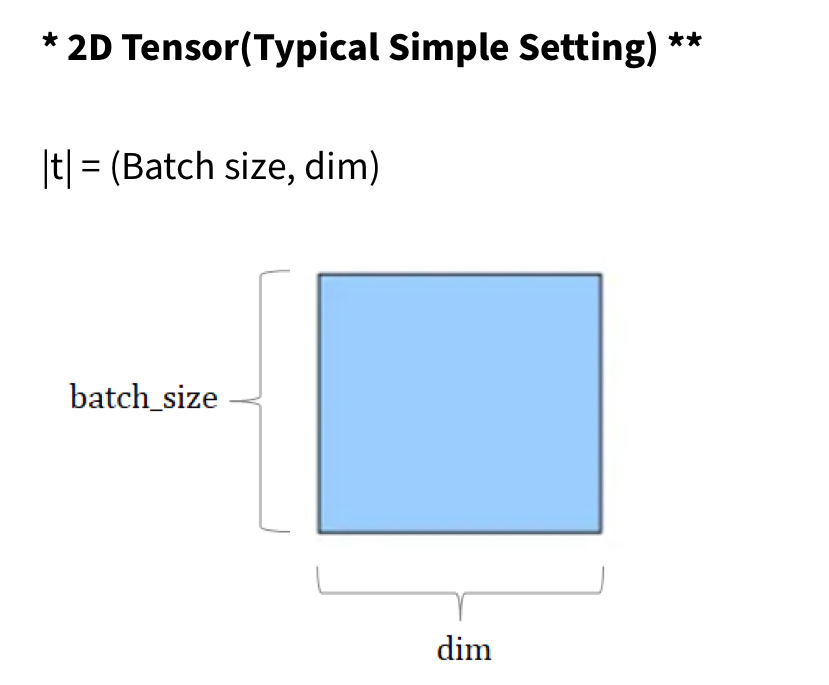
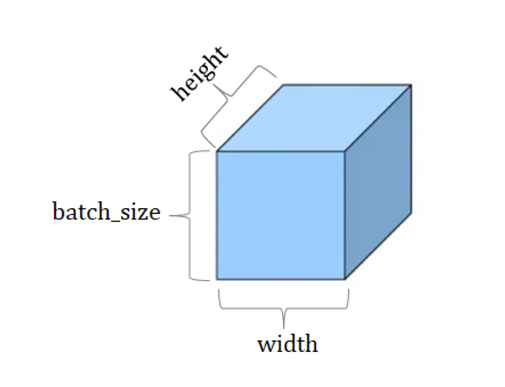
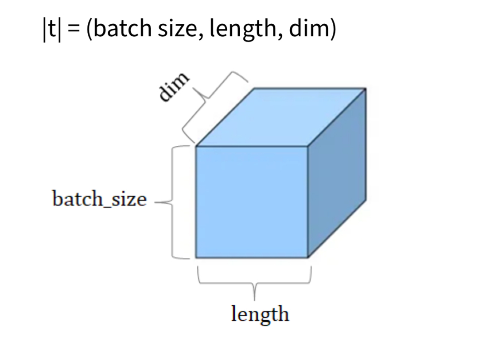

# Study_PyTorch_DeepLearning
"딥 러닝 파이토치 교과서 - 입문부터 LLM 파인튜닝까지" 실습 공간

본 리포는 "딥 러닝 파이토치 교과서 - 입문부터 LLM 파인튜닝까지"( Bryce and Eddie, wikidocs, https://wikidocs.net/book/2788 )의 실습 결과와 개인적인 추가 코드로 이루어져 있습니다.

## 중요 개념 & 햇갈리는 개념 정리

### 텐서
n차원으로 구성된 배열  
ex.  
벡터 = 1차원 텐서  
행렬 = 2차원 텐서  
3차원 이상 : 3차원 텐서, 4차원 텐서...  

2차원 텐서의 경우, (행렬로 치면) 행의 크기 : batch size, 열의 크기 : dim

비전 분야와 자연어 분야의 텐서 차원별 네이밍이 다르다.

###### 3D텐서 - 비전에서
|t|=(batch size, widht, height)  

###### 3D텐서 - NLP에서 

#### Broadcasting
행렬의 연산시 파이토치가 브로드캐스팅을 통해 크기를 맞춰줌.
*이런 기능은 없는게 낫지 않을까? 많이 했갈릴 것 같다.*

#### Dot Product vs Element-Wise Multiplication
 \* :  element-wise mult. *매트랩과 다르다*  
 tensor1.mul(tensor2) : element-wise mult.  
 tensor1.matmul(tensor2) : (matrix multiplication, dot product)  
 *Explicit하게 사용하는 습관을 들여놓아야 좋을듯. 딱봐도 햇갈리기 좋다*  
 
#### In-place Operation : 덮어쓰기 연산.
tensor1.mul(tensor2) : 반환값은 tensor1과 tensor2의 요소곱 
tensor1.mul_(tensor2) : 반환값은 동일. 그러나 **tensor1의 값 자체가 변한다**  